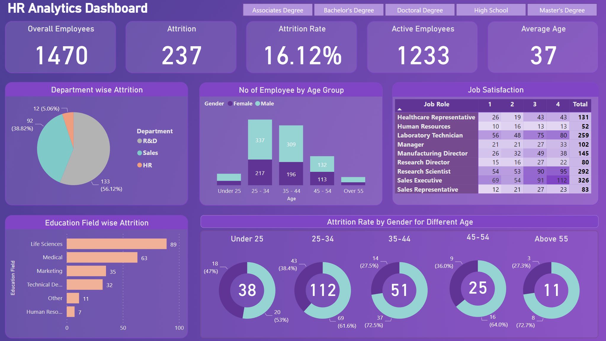
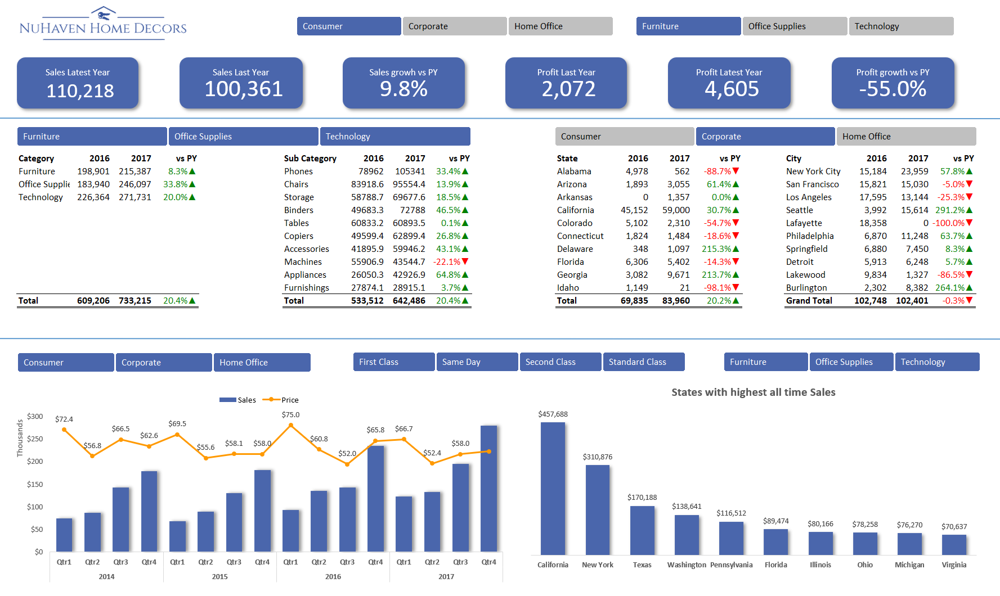
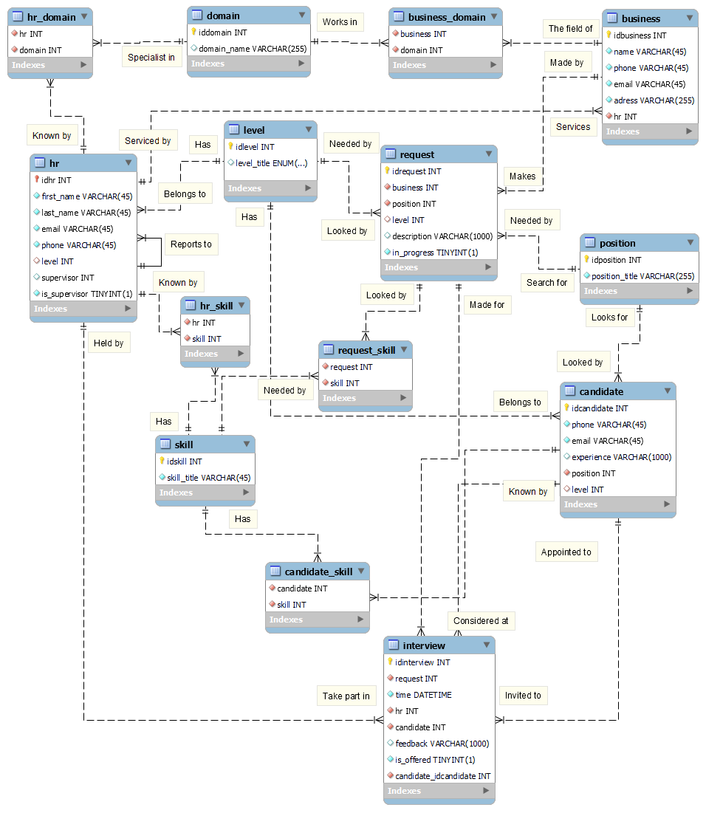

# Table of Contents
   1. [Power BI](#power-bi)
      - [HR Analytics Dashboard](#hr-analytics-dashboard)
   2. [Excel](#excel)
      - [Sales Analytics Dashboard](#sales-analytics-dashboard)
   3. [Modeling](#modeling)
      - [Data Modeling](#data-modeling)
        - [Recruitment Agency Data Model](#recruitment-agency-data-model)
      - [Processes Modeling](#processes-modeling)
        - [Deal No Deal BPMN Diagram](#deal-no-deal-bpmn-diagram)

# Projects

## Power BI

### HR Analytics Dashboard

 

  

[HR Analytics Dashboard](./hr_analytics/) provides a holistic and user-friendly view of critical HR metrics, aiding in data-driven decision-making and strategic planning.

## Excel

### Sales Analytics Dashboard

 

  

An intuitive Excel [Sales Analytics Dashboard](./sales_analytics/) that transforms raw data into visually compelling, actionable insights with dynamic filters.

## Modeling

### Data Modeling

#### Recruitment Agency Data Model

 

  

The [Recruitment Agency Data Model](./recruitment_agency/) visualizes the complex relationships between businesses, HR personnel, and candidates, streamlining the recruitment process through a structured database design. It facilitates efficient candidate tracking, interview scheduling, and feedback management.

### Processes Modeling

#### Deal No Deal BPMN Diagram

 

  

[Deal or No Deal BPMN Game Process Flow](./deal_nodeal/) outlines the player's journey from qualification to prize collection, providing a structured flow for game progression and decision-making points.