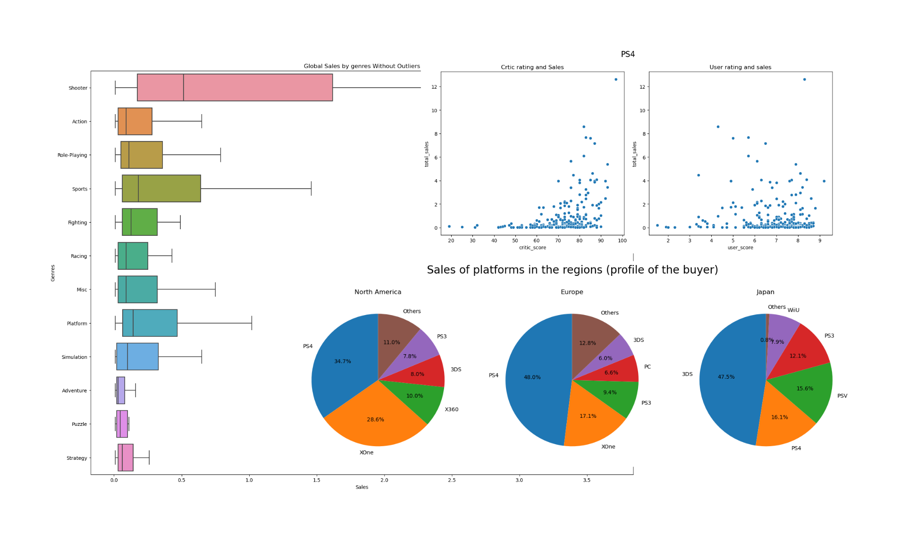
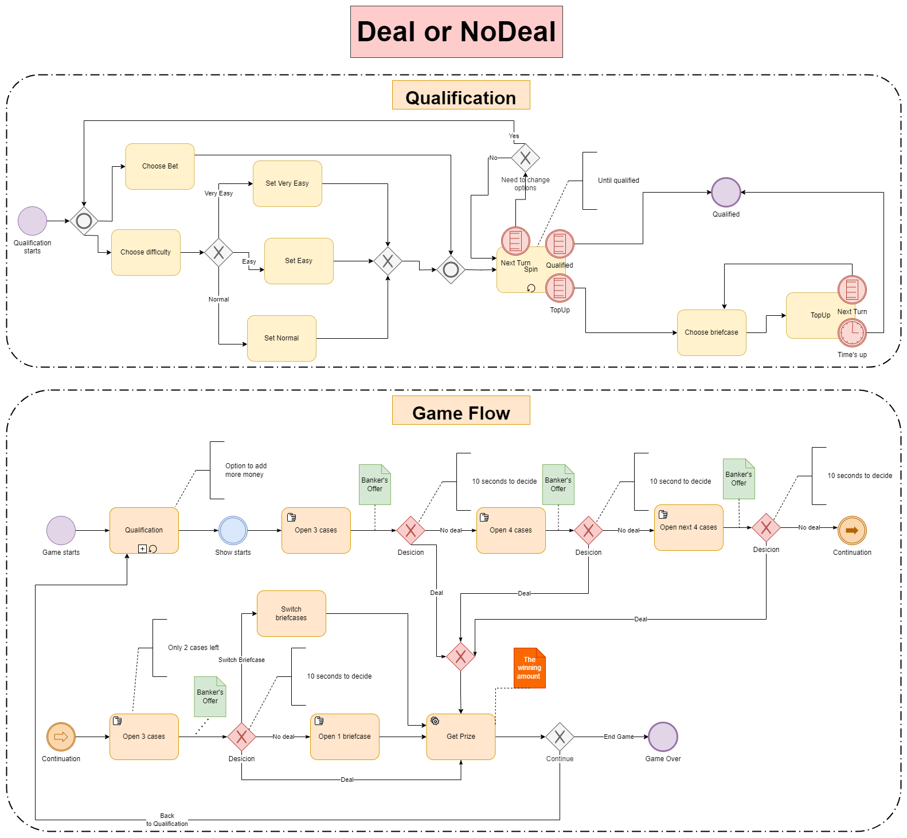

# Table of Contents
   1. [Business Intelligence](#business-intelligence)
      - [Power BI](#power-bi)
        - [HR Analytics Dashboard](#hr-analytics-dashboard)
      - [Excel](#excel)
        - [Sales Analytics Dashboard](#sales-analytics-dashboard)
   2. [Data Analysis](#data-analysis)
      - [Python](#python)
        - [Research of the video game market](#research-of-the-video-game-market)
   3. [Modeling](#modeling)
      - [Data Modeling](#data-modeling)
        - [Recruitment Agency Data Model](#recruitment-agency-data-model)
      - [Processes Modeling](#processes-modeling)
        - [Deal No Deal BPMN Diagram](#deal-no-deal-bpmn-diagram)

# Projects

## Business Intelligence

### Power BI

#### HR Analytics Dashboard

 

  

[HR Analytics Dashboard](./hr_analytics/) provides a holistic and user-friendly view of critical HR metrics, aiding in data-driven decision-making and strategic planning.

### Excel

#### Sales Analytics Dashboard

 

  

An intuitive Excel [Sales Analytics Dashboard](./sales_analytics/) that transforms raw data into visually compelling, actionable insights with dynamic filters.

## Data Analysis

### Python

#### Research of the video game market

  

The [Games Industry Research Project](./game_industry/games_industry_research.ipynb) provides an in-depth analysis of the gaming sector, combining statistical data, industry trends, and demographic insights. This project aims to offer stakeholders a comprehensive view of the current gaming market, aiding in strategic decision-making and market positioning.

## Modeling

### Data Modeling

#### Recruitment Agency Data Model

 

  

The [Recruitment Agency Data Model](./recruitment_agency/) visualizes the complex relationships between businesses, HR personnel, and candidates, streamlining the recruitment process through a structured database design. It facilitates efficient candidate tracking, interview scheduling, and feedback management.

### Processes Modeling

#### Deal No Deal BPMN Diagram

 

  

[Deal or No Deal BPMN Game Process Flow](./deal_nodeal/) outlines the player's journey from qualification to prize collection, providing a structured flow for game progression and decision-making points.