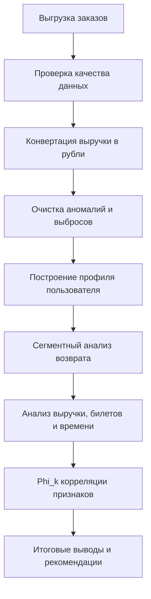
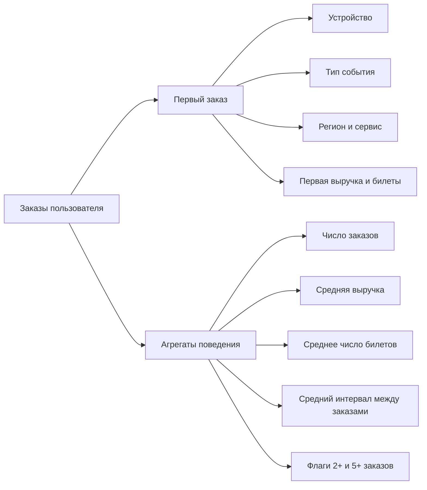
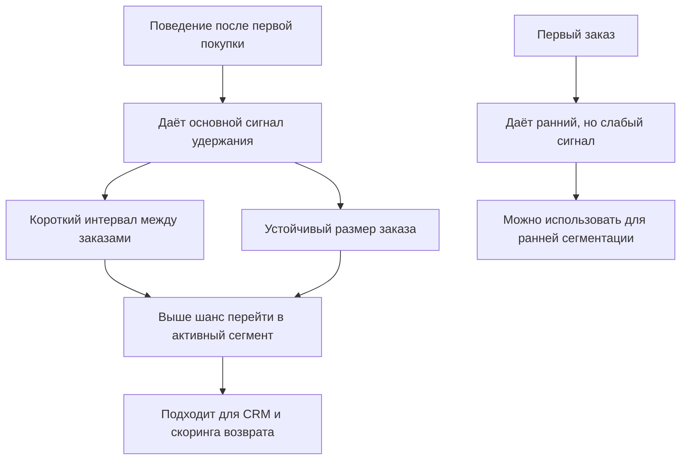

# Анализ лояльности пользователей Яндекс Афиши

Исследование пользовательского поведения в сервисе Яндекс Афиша: от очистки заказов и построения пользовательского профиля до анализа факторов, связанных с повторными покупками и удержанием.

Основной артефакт проекта: [afisha_v3.ipynb](/c:/Users/siarh/Documents/Yandex/afisha/afisha_v3.ipynb)

## О проекте

Цель исследования — понять, какие характеристики первого заказа и последующего поведения пользователя связаны с возвратом на платформу, и на основе этого сформулировать прикладные рекомендации для CRM и продуктовой команды.

В работе я:

- подготовил и очистил данные о заказах;
- привёл выручку к единой валюте;
- собрал профиль пользователя на уровне клиента;
- сравнил сегменты по возврату;
- исследовал влияние выручки, количества билетов и временных интервалов;
- выделил признаки, наиболее связанные с числом заказов.

## Данные

Используются данные о заказах Яндекс Афиши:

- `user_id`, `order_id` — идентификаторы пользователя и заказа;
- `order_dt`, `order_ts` — дата и точное время заказа;
- `device_type_canonical` — тип устройства;
- `revenue`, `currency_code`, `tickets_count` — монетизация и состав заказа;
- `event_type_main`, `service_name`, `region_name`, `city_name` — характеристики события и географии;
- `days_since_prev` — интервал между текущим и предыдущим заказом;
- `final_tickets_tenge_df.csv` — справочник для перевода тенге в рубли.

В анализ включены только заказы с устройств `mobile` и `desktop`. События типа `фильм` исключены на этапе выгрузки.

## Ход исследования



## Структура пользовательского профиля



## Ключевые результаты

- После очистки в профиле осталось `21 483` пользователя.
- Базовый уровень возврата составил `61.28%`.
- Самый сильный сегмент по возврату — пользователи со средним заказом `2-3 билета` (`73.47%`).
- Сегмент `5+ билетов` заметно слабее по удержанию (`18.87%`) и больше похож на сценарий разовой крупной покупки.
- Пользователи спорта возвращаются хуже, чем пользователи концертов: `54.90%` против `61.78%`.
- День недели первой покупки влияет слабо: разница между лучшим и худшим днём составляет `3.30 п.п.`.
- Самые сильные признаки по `Phi_k` связаны не с первым заказом, а с поведением пользователя:
  - `avg_days_between = 0.40`
  - `avg_tickets = 0.38`
  - `avg_revenue = 0.33`

## Интерпретация результатов



## Практические рекомендации

- Работать с пользователем особенно активно в первые `1-2 недели` после первой покупки: у аудитории с `5+` заказами средний интервал между покупками составляет `9.89` дня, у группы `2-4` заказа — `21.24` дня.
- Разделять сценарии коммуникации по типу поведения, а не только по первому заказу.
- Для сегмента `2-3 билета` делать упор на удержание и увеличение частоты покупок.
- Для сегмента `5+ билетов` и аудитории спорта использовать отдельные реактивационные сценарии.
- В моделях скоринга опираться прежде всего на поведенческие признаки, а стартовые характеристики использовать как ранние маркеры.

## Структура репозитория

```text
.
|-- afisha_v3.ipynb
|-- afisha.csv
|-- final_tickets_tenge_df.csv
|-- requirements.txt
|-- .gitignore
`-- README.md
```

## Запуск проекта

1. Создать и активировать виртуальное окружение.
2. Установить зависимости:

```bash
pip install -r requirements.txt
```

3. При необходимости создать `.env` с параметрами подключения к БД:

```env
DB_USER=...
DB_PASSWORD=...
DB_HOST=...
DB_PORT=...
DB_NAME=...
```

4. Открыть и выполнить [afisha_v3.ipynb](/c:/Users/siarh/Documents/Yandex/afisha/afisha_v3.ipynb).

Если файл `afisha.csv` уже лежит в проекте, ноутбук использует локальную выгрузку и не обращается к базе.

## Стек

- Python
- pandas
- numpy
- matplotlib
- seaborn
- SQLAlchemy
- psycopg2-binary
- python-dotenv
- phik
