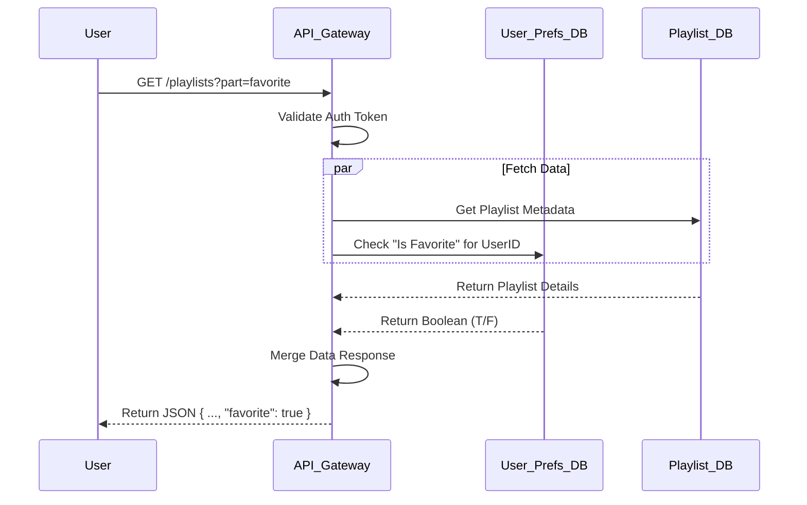
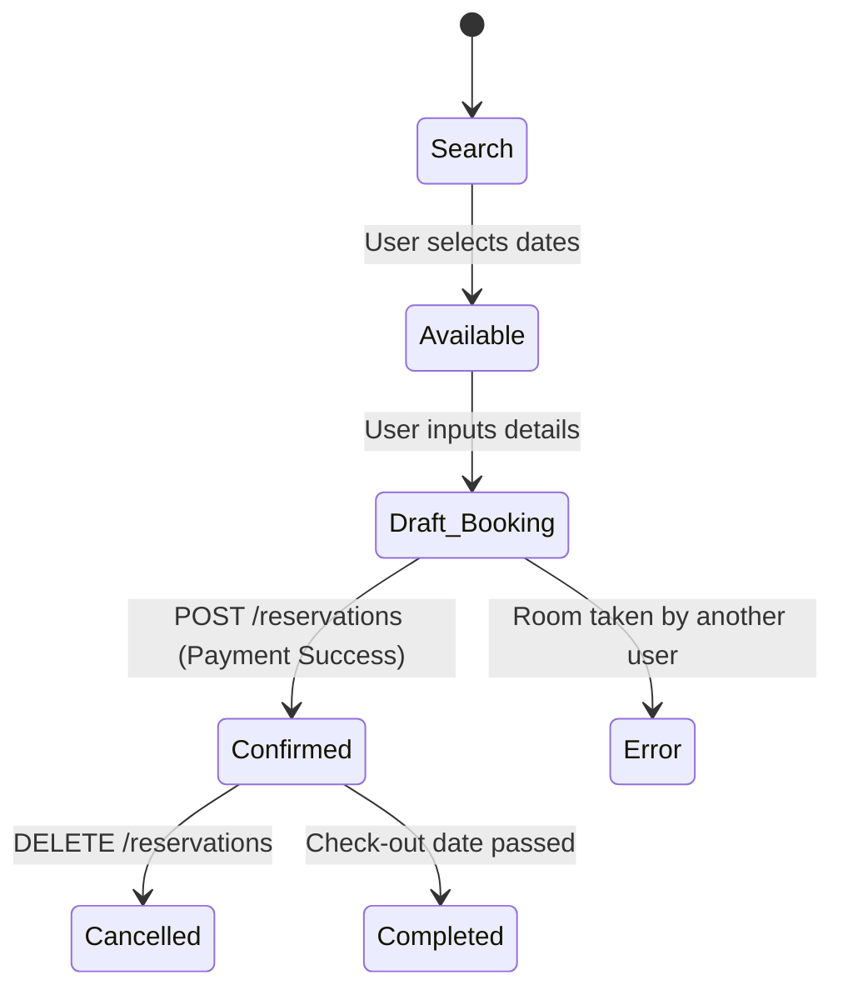

<p align="center">
  
</p>

# Project Overview

This repository defines the interface contracts and architectural logic for two core backend services.

1. **Legacy Enhancement:** Extending the YouTube Data API to support a "Favorites" feature.
2. **Greenfield Design:** Creating a Hotel Booking API from scratch, handling search, reservation, and cancellation flows.

# Table of Contents

```table-of-contents
```

# Extending the YouTube Data API to support a "Favorites" feature

## Logic Flow for "Favorites"

This diagram illustrates how the backend merges public playlist data with private user preferences




## US1. List Playlists with Favorite Node
As a user,
I want to see whether each playlist is marked as “favorite” or not
So that I can easily identify my preferred playlists in my list view

**Acceptance criteria**

1. The `GET /youtube/v3/playlists` endpoint must return an additional field `"favorite": boolean` for each playlist in the response.
2. The `"favorite"` field should be available under the root of each playlist resource
3. If the playlist is not marked as favorite, the field should return `false` by default.
4. The `part` parameter should support `"favorite"` as a valid part. If not requested, the field will not appear in the response
5. The backend should retrieve the favorite status from user data

## US2. Create Playlist with Favorite Node
As a user,
I want to be able to create a playlist and immediately mark it as a favorite
So that my new playlists can be prioritized or filtered later

**Acceptance criteria**

1. The `POST /youtube/v3/playlists` endpoint must accept a `favurite` boolean field in the request body
	1. If omitted, default `favurite = false`
2. The `favorite` field should also be included in the API response.
	1. Validation error `invalidFavoriteValue` (400) if `favorite` is not boolean
3. Setting `favorite = true` should create a record in the `user_playlist_preferences` mapping for the authenticated user
4. Only authenticated users can set or modify the `favorite` status

## US3. Update Playlist Favorite Node

**Acceptance criteria**

1. The `PUT /youtube/v3/playlists` endpoint must allow updating the `favorite` field
2. The `favorite` field is optional
	1. If provided, updates user preference mapping accordingly
3. Response must include the updated `favorite` status
	1. Returns `invalidFavoriteValue` (400) if invalid type
4. The system must validate ownership - only playlist owners can modify favorite status

## US4. Delete Playlist with Enhanced Authorization Errors
As a user,
I want clear error messages when deleting playlists
So that I know whether the issue is with my authentication (401) or permissions (403)

**Acceptance criteria**

1. `DELETE /youtube/v3/playlists` must return `401 Unauthorized` if no valid access token or expired token is provided
	1. Must return `403 Forbidden` only when the user is authenticated but not authorized to delete the playlist

## Updated API Documentation

### Playlists: list
**Endpoint:**  `GET https://www.googleapis.com/youtube/v3/playlists`

Sample Request
```http
GET https://www.googleapis.com/youtube/v3/playlists?part=snippet,contentDetails,favorite&mine=true
```

Sample Response
```json
{
  "kind": "youtube#playlist",
  "etag": etag,
  "id": string,
  "snippet": object,
  "status": object,
  "contentDetails": object,
  "player": object,
  "localizations": object,
  "favorite": boolean
}
```

### Playlists: insert
**Endpoint:**  `POST https://www.googleapis.com/youtube/v3/playlists`

Sample Request
```http
POST https://www.googleapis.com/youtube/v3/playlists?part=snippet,status,favorite
Content-Type: application/json
```

Request Body
```json
{
  "snippet": {
    "title": "Travel Vlogs",
    "description": "My travel adventures"
  },
  "status": {
    "privacyStatus": "public"
  },
  "favrite": true
}
```

Sample Response
```json
{
  "kind": "youtube#playlist",
  "etag": etag,
  "id": string,
  "snippet": {
    "publishedAt": datetime,
    "channelId": string,
    "title": "Travel Vlogs",
    "description": "My travel adventures",
    "thumbnails": {
      "(key)": {
        "url": string,
        "width": unsigned integer,
        "height": unsigned integer
      }
    },
    "channelTitle": string,
    "defaultLanguage": string,
    "localized": {
      "title": "Travel Vlogs",
      "description": "My travel adventures"
    }
  },
  "status": {
    "privacyStatus": "public",
    "podcastStatus": enum
  },
  "contentDetails": {
    "itemCount": unsigned integer
  },
  "player": {
    "embedHtml": string
  },
  "localizations": {
    "(key)": {
      "title": string,
      "description": string
    }
  },
  "favorite": true
}
```

### Playlists: update
**Endpoint:**  `PUT https://www.googleapis.com/youtube/v3/playlists`

Sample Request
```http
PUT https://www.googleapis.com/youtube/v3/playlists?part=snippet,status,favorite
Content-Type: application/json
```

Request Body
```json
{
  "id": "PL123456789",
  "snippet": {
    "title": "Travel Vlogs",
    "description": "My travel adventures"
  },
  "status": {
    "privacyStatus": "public"
  },
  "favorite": true
}
```

Sample Response
```json
{
  "kind": "youtube#playlist",
  "etag": etag,
  "id": "PL123456789",
  "snippet": {
    "publishedAt": datetime,
    "channelId": string,
    "title": "Travel Vlogs",
    "description": "My travel adventures",
    "thumbnails": {
      "(key)": {
        "url": string,
        "width": unsigned integer,
        "height": unsigned integer
      }
    },
    "channelTitle": string,
    "defaultLanguage": string,
    "localized": {
      "title": "Travel Vlogs",
      "description": "My travel adventures"
    }
  },
  "status": {
    "privacyStatus": "public",
    "podcastStatus": enum
  },
  "contentDetails": {
    "itemCount": unsigned integer
  },
  "player": {
    "embedHtml": string
  },
  "localizations": {
    "(key)": {
      "title": string,
      "description": string
    }
  },
  "favorite": true
}
```

### Playlists: delete
**Endpoint:**  `DELETE https://www.googleapis.com/youtube/v3/playlists

Sample Request
```http
DELETE https://www.googleapis.com/youtube/v3/playlists?id=PL123456789
```

Sample Response
```http
HTTP/1.1 204 No Content
```

### Error Table

| Error type           | Error detail                   | Description                                                                                                                         |
| -------------------- | ------------------------------ | ----------------------------------------------------------------------------------------------------------------------------------- |
| `unauthorized (401)` | `unauthorizedRequest`          | The request lacks valid authentication credentials (missing, invalid, or expired OAuth token).                                      |
| `forbidden (403)`    | `playlistForbidden`            | The authenticated user does not have permission to delete the specified playlist                                                    |
| `notFound (404)`     | `playlistNotFound`             | The playlist identified with the request's id parameter cannot be found.                                                            |
| `invalidValue (400)` | `playlistOperationUnsupported` | The API does not support the ability to delete the specified playlist. For example, you can't delete your uploaded videos playlist. |
Sample `401` Response
```json
{
  "error": {
    "code": 401,
    "message": "Request requires valid authentication credentials.",
    "errors": [
      {
        "message": "Request requires valid authentication credentials.",
        "domain": "global",
        "reason": "unauthorizedRequest"
      }
    ]
  }
}
```

# Creating a Hotel Booking API 

## Hotel API: Reservation State Machine



## US1: Searching for Available Rooms

> As a booking agent,
> I want to search for available rooms by location, check-in date, and check-out date,
> so that I can find suitable options for a client

**Acceptance criteria**

1. The API `/rooms/available` must accept `location`, `check_in_date`, and `check_out_date` as query parameters.
2. The response must be a list of all rooms available for the entire duration of the specified dates.
3. Each room in the response list must include its unique ID `room_id`, room size `room_size`, and the nightly rate `rate_per_night`.
4. If no rooms are available, the API should return a successful response with an empty list.
5. The API should return an error if the dates are invalid.

**Endpoint:**  `GET https://api.hotel.com/rooms/available`

This request fetches rooms available in "Klaipeda" from Nov 10 to Nov 15, 2025

Sample Request
```http
GET https://api.hotel.com/rooms/available?location=Klaipeda&check_in_date=2025-11-10&check_out_date=2025-11-15
Authorization: Bearer <AUTH_TOKEN>
```

Sample Response `200 OK`
```json{
  "search_criteria": {
    "location": "Klaipeda",
    "check_in_date": "2025-11-10",
    "check_out_date": "2025-11-15"
  },
  "available_rooms": [
    {
      "room_id": "KNG101",
      "room_size": "King Suite",
      "rate_per_night": 150.00
    },
    {
      "room_id": "DQN205",
      "room_size": "Double Queen",
      "rate_per_night": 125.50
    }
  ]
}
```
## US2: Booking a Room

> As a booking agent,
> I want to book an available room for a specific date range,
> so that I can secure the reservation for a client and receive a confirmation

**Acceptance criteria**

1. The API `/reservations` must allow booking a room by providing a `room_id`, `check_in_date`, `check_out_date`, and guest details.
2. On successful booking, the API must return a `201 Created` status code.
3. The response body for a successful booking must include a unique `reservation_id`.
4. The API must prevent booking a room that is already reserved for the requested dates and return an error `409 Conflict`.

**Endpoint:**  `POST https://api.hotel.com/rooms/reservations

This request books the "King Suite" (`KNG101`) found in the search

Sample Request
```http
POST https://api.yourhotel.com/reservations
Content-Type: application/json
Authorization: Bearer <AUTH_TOKEN>
```

Request Body
```json
{
  "room_id": "KNG101",
  "check_in_date": "2025-11-10",
  "check_out_date": "2025-11-15",
  "guest_details": {
    "full_name": "John Doe",
    "email": "john.doe@example.com"
  }
}
```

Sample Response `201 Created`
```json
{
  "message": "Room reserved successfully!",
  "reservation_id": "RES-8A3F9B2C",
  "booking_details": {
    "room_id": "KNG101",
    "check_in_date": "2025-11-10",
    "check_out_date": "2025-11-15"
  }
}
```

## US3: Cancel Reservation

> As a booking agent, I want to cancel an existing reservation using its unique ID, so that the room becomes available for other clients and the original client is not charged.

**Acceptance criteria**

1. The API `/reservations/{reservation_id}` must accept a `DELETE` request to remove a booking.
2. The system must validate that the reservation exists; otherwise, it must return `404 Not Found`.
3. The API must enforce a cancellation policy: reservations cannot be cancelled if the `check_in_date` is within the next 24 hours. In this case, it must return `409 Conflict` with an error message.
4. On successful cancellation, the API must return a `200 OK` (with confirmation message) or `204 No Content` status code.
5. The system must release the room inventory immediately upon success.

**Endpoint:** `DELETE https://api.hotel.com/reservations/{reservation_id}`

This request cancels the reservation `RES-8A3F9B2C` created in the previous step.

Sample Request
```http
DELETE https://api.hotel.com/reservations/RES-8A3F9B2C
Authorization: Bearer <AUTH_TOKEN>
```

Sample Response `200 OK`
```json
{
  "message": "Reservation cancelled successfully.",
  "reservation_id": "RES-8A3F9B2C",
  "status": "CANCELLED",
  "cancellation_time": "2025-10-01T14:30:00Z"
}
```