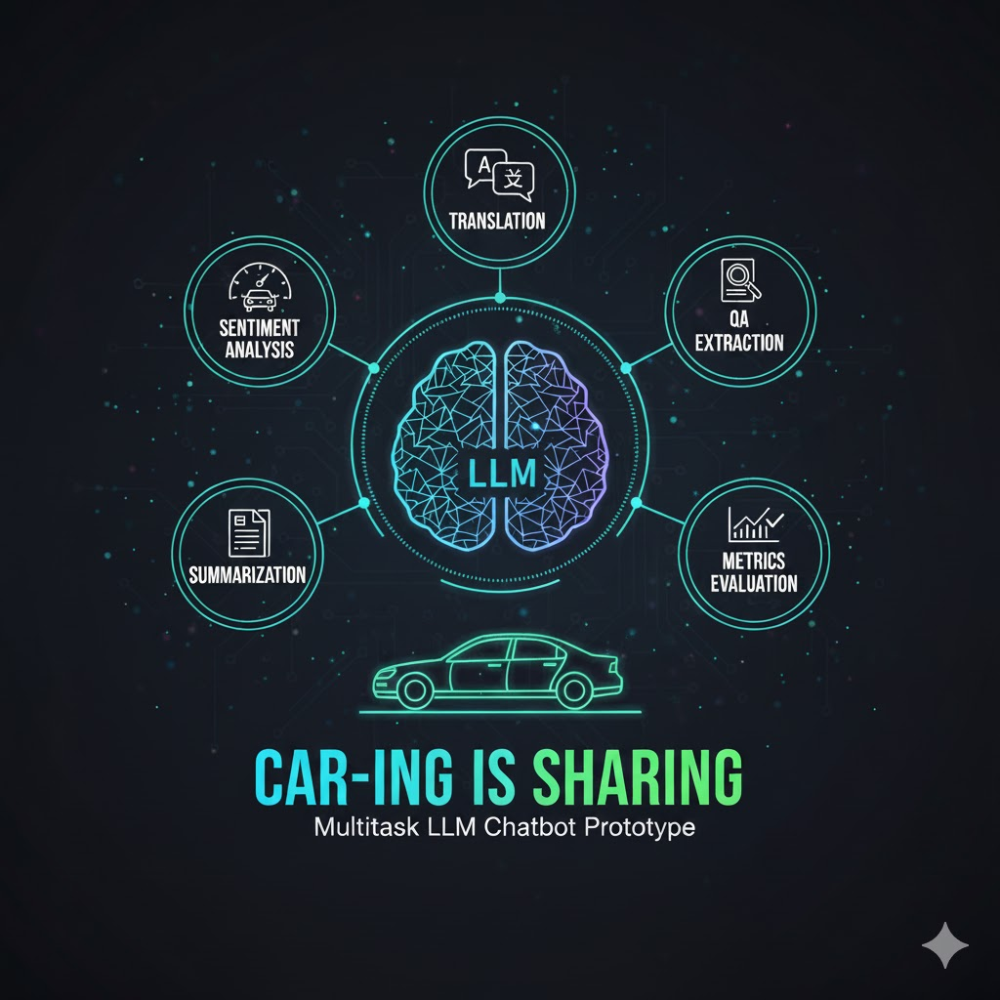
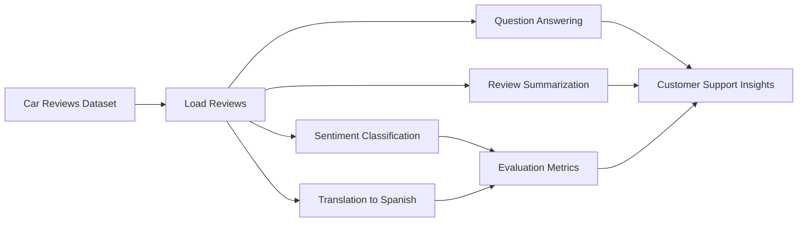

# Cars Review LLM Analysis POC

This project is a proof-of-concept for a multitask LLM-powered chatbot prototype for **Car-ing is sharing**, a car sales and rental company serving international customers. It demonstrates how pre-trained Hugging Face models can turn raw vehicle reviews into practical customer-support signals.

The notebook analyzes car review text across several NLP tasks: sentiment classification, English-to-Spanish translation, extractive question answering, review summarization, and model-output evaluation. The goal is to show how a compact LLM workflow can help teams quickly understand customer feedback, detect negative or toxic sentiment, support Spanish-speaking customers, and summarize long reviews for faster intake.

## Workflow

## What It Demonstrates

- Classifying review sentiment as positive or negative with DistilBERT.
- Translating review excerpts into Spanish for international customer support.
- Answering targeted questions from review text with an extractive QA model.
- Summarizing long reviews into concise customer-feedback notes.
- Evaluating model outputs with standard NLP metrics.

## Tech Stack

- Python
- Jupyter Notebook
- pandas
- Hugging Face Transformers
- DistilBERT
- Helsinki-NLP translation model
- MiniLM SQuAD QA model
- DistilBART summarization model

## Files

- [cars_review_analysis_llm.ipynb](cars_review_analysis_llm.ipynb): main notebook with the end-to-end LLM analysis workflow.
- [car_reviews_llm.jpg](car_reviews_llm.jpg): project cover image used in the notebook and README.
