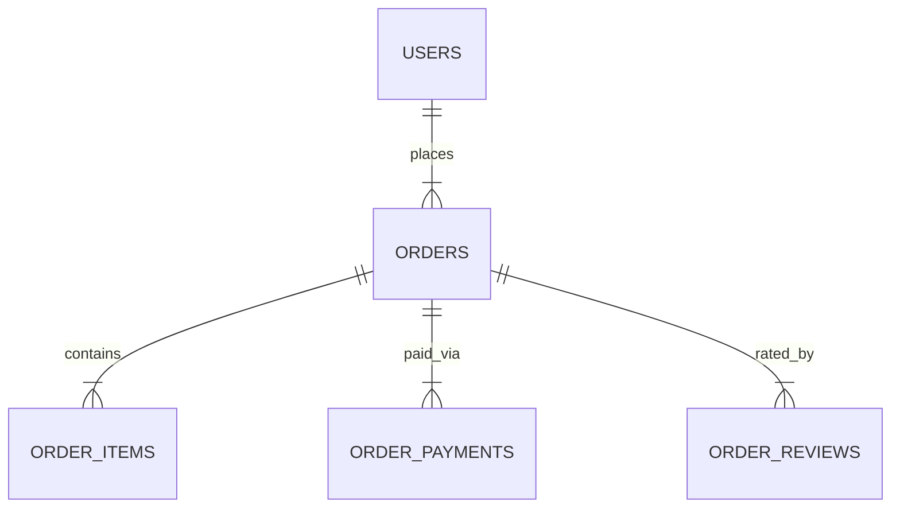

# E-commerce Data Mart & Cohort Analysis 🛒

  

## 📋 Project Overview

This project focuses on the end-to-end data engineering and analysis lifecycle for "AllHere," an e-commerce marketplace. The goal was to transform raw transactional logs into a usable **User-Profile Data Mart** and perform exploratory data analysis (EDA) to solve specific business problems.

The project is divided into two phases:
1.  **ETL & Data Modeling:** Aggregating raw data (orders, payments, reviews) into a unified "User Features" table.
2.  **Business Intelligence:** Running Ad-hoc queries to investigate retention, regional performance, and seasonal trends.

## 🗄️ Data Schema & Architecture

The raw data consisted of four relational tables. Below is a simplified relationship diagram of the source data:

## 📊 Key Business Insights

Based on the Ad-hoc analysis performed in Part 2, several critical trends were identified:

### 1. Retention Crisis

- **Finding:** The vast majority of the user base (~60,000 users) made only **one purchase**.
    
- **Implication:** The platform is currently functioning as a destination for one-off purchases rather than a habit-forming marketplace. Acquisition costs are likely not being offset by LTV.
    

### 2. Seasonality & Service Strain

- **Finding:** New user acquisition exploded in **Q4 (November)**, growing 10x compared to January.
    
- **Implication:** While marketing successfully drove traffic during the holiday season, the **average rating dropped** during this period. This suggests logistics or customer support could not handle the scale, negatively impacting customer experience.
    

### 3. Regional Behavior

- **Finding:**
    
    - **Moscow:** High volume, low average check.
        
    - **St. Petersburg:** Higher average check, significantly higher usage of promo codes and installments.
        
- **Implication:** Marketing strategies should be localized. St. Petersburg users are more price-sensitive but willing to spend more if given financial tools (installments) or incentives (promos).
    

### 4. Inverse Volume/Value Correlation

- **Finding:** The most loyal users (high frequency) have a significantly lower Average Order Value than one-time buyers.
    
- **Implication:** High-ticket items (electronics, appliances) drive the initial purchase, while recurring purchases are likely low-cost commodities.