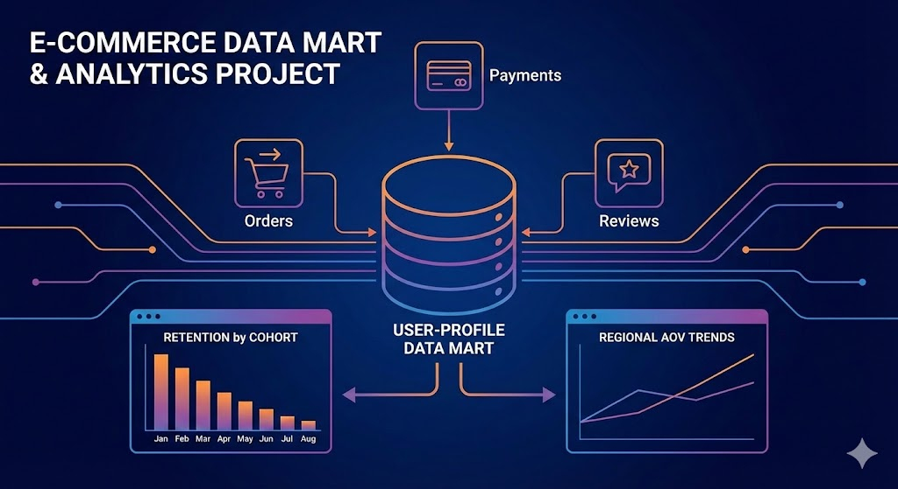
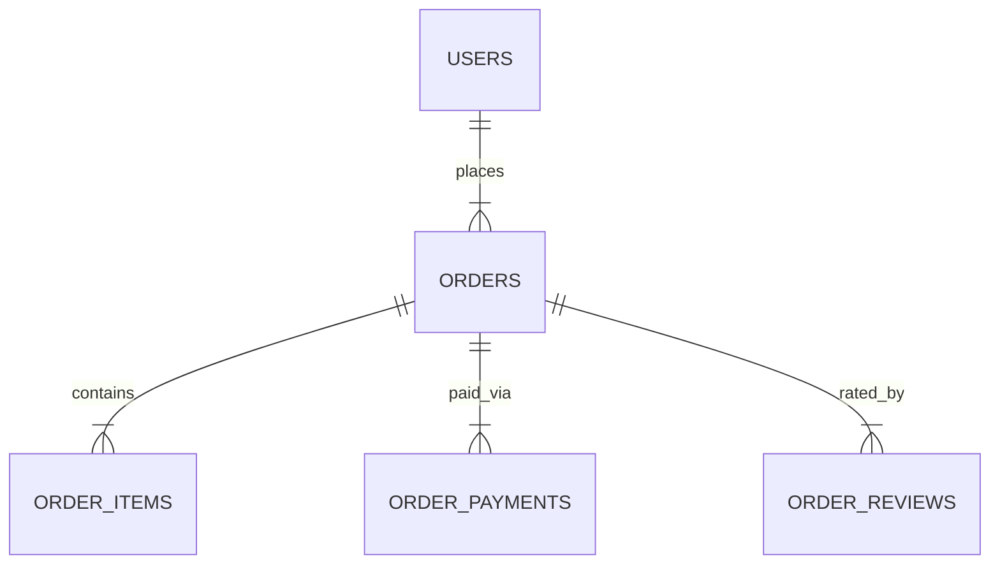

# E-commerce Data Mart & Cohort Analysis 🛒

  

## 📋 Project Overview

This project focuses on the end-to-end data engineering and analysis lifecycle for "AllHere," an e-commerce marketplace. The goal was to transform raw transactional logs into a usable **User-Profile Data Mart** and perform exploratory data analysis (EDA) to solve specific business problems.

The project is divided into two phases:
1.  **ETL & Data Modeling:** Aggregating raw data (orders, payments, reviews) into a unified "User Features" table.
2.  **Business Intelligence:** Running Ad-hoc queries to investigate retention, regional performance, and seasonal trends.

## 🗄️ Data Schema & Architecture

The raw data consisted of four relational tables. Below is a simplified relationship diagram of the source data:

## 📂 Data Mart Output

The final result of the ETL process is a user-centric Data Mart (`product_user_features`). Below is a sample of the output and the definition of key metrics.

### Sample Output (First 5 Rows)

| user_id | region | first_order_ts | total_orders | lifetime | avg_rating | canceled_% | total_spend | avg_check | promo_orders | install_orders | used_installments (Flag) |
| :--- | :--- | :--- | :--- | :--- | :--- | :--- | :--- | :--- | :--- | :--- | :--- |
| `a1b2...` | Berlin | 2023-01-15 | 1 | 0 days | 4.5 | 0.0% | $250.00 | $250.00 | 0 | 0 | 0 |
| `c3d4...` | Paris | 2023-02-10 | 4 | 45 days | 3.8 | 0.0% | $1,200.00 | $300.00 | 2 | 2 | 1 |
| `e5f6...` | Amsterdam | 2023-03-01 | 12 | 120 days | 4.9 | 0.0% | $960.00 | $80.00 | 5 | 0 | 0 |
| `g7h8...` | Berlin | 2023-01-20 | 2 | 5 days | 2.0 | 50.0% | $100.00 | $100.00 | 0 | 0 | 0 |
| `i9j0...` | London | 2023-04-12 | 3 | 12 days | 5.0 | 0.0% | $2,400.00 | $800.00 | 1 | 3 | 1 |

### Data Dictionary

| Column Name | Type | Description |
| :--- | :--- | :--- |
| `user_id` | String | Unique identifier for the customer. |
| `region` | String | Customer's primary geographic region (Top 3 only). |
| `lifetime` | Interval | Time elapsed between the first and last purchase. |
| `avg_order_rating` | Float | Normalized rating (1-5 scale) across all rated orders. |
| `canceled_orders_ratio` | Float | Percentage of total orders that were canceled. |
| `avg_order_cost` | Numeric | Average Order Value (AOV) calculated from delivered orders only. |
| `used_money_transfer` | Binary | **1** if the user ever paid via direct transfer, **0** otherwise. |
| `used_installments` | Binary | **1** if the user ever used a payment plan (installments), **0** otherwise. |

## 📊 Key Business Insights

Based on the Ad-hoc analysis performed in Part 2, several critical trends were identified:

### 1. Retention Crisis

- **Finding:** The vast majority of the user base (~60,000 users) made only **one purchase**.
    
- **Implication:** The platform is currently functioning as a destination for one-off purchases rather than a habit-forming marketplace. Acquisition costs are likely not being offset by LTV.
    

### 2. Seasonality & Service Strain

- **Finding:** New user acquisition exploded in **Q4 (November)**, growing 10x compared to January.
    
- **Implication:** While marketing successfully drove traffic during the holiday season, the **average rating dropped** during this period. This suggests logistics or customer support could not handle the scale, negatively impacting customer experience.
    

### 3. Regional Behavior

- **Finding:**
    
    - **Moscow:** High volume, low average check.
        
    - **St. Petersburg:** Higher average check, significantly higher usage of promo codes and installments.
        
- **Implication:** Marketing strategies should be localized. St. Petersburg users are more price-sensitive but willing to spend more if given financial tools (installments) or incentives (promos).
    

### 4. Inverse Volume/Value Correlation

- **Finding:** The most loyal users (high frequency) have a significantly lower Average Order Value than one-time buyers.
    
- **Implication:** High-ticket items (electronics, appliances) drive the initial purchase, while recurring purchases are likely low-cost commodities.