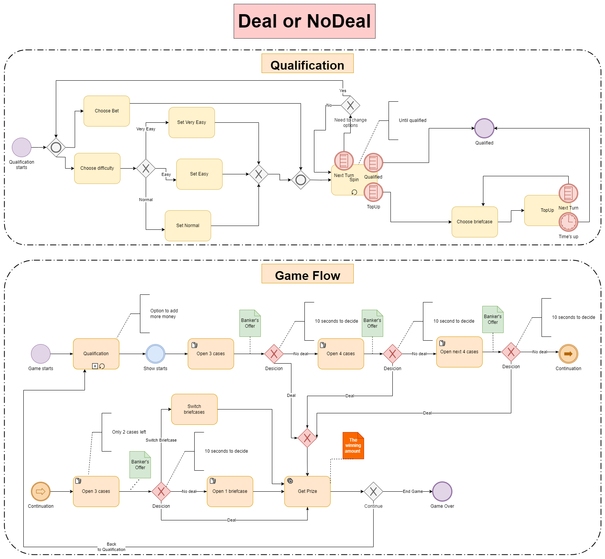

# Deal No Deal Fame Flow BPMN Diagram

  

The Deal or No Deal Game Process is a Business Process Model and Notation (BPMN) diagram that captures the sequential flow and decision points of a player’s experience within the game. This model is divided into two main sections: Qualification and Game Flow, each detailing the steps a player takes from the start of the game to the end.

## Qualification Process

1. **Start:** Players begin by entering the qualification phase where they make their initial choices.
2. **Choose Bet and Difficulty:** Players select a bet and set the difficulty level, ranging from 'Very Easy' to 'Normal'.
3. **Adjust Options:** Players may need to adjust their options through top-ups or changes until they meet the qualification requirements.
4. **Qualification Completion:** Once players have successfully qualified, they can choose a briefcase and move on to the main game flow.

## Main Game Flow

1. **Game Initiation:** The game starts with the show's opening, where players are presented with a number of cases to open.
2. **Open Cases:** Players open a set number of cases to reveal potential prize amounts.
3. **Banker's Offer:** After each set of cases, players receive a banker’s offer.
4. **Make a Decision:** Players must decide whether to accept (Deal) or reject (No Deal) the banker’s offer within a specified timeframe.
5. **Repeat Process:** This process of opening cases and receiving offers repeats, with the number of cases reducing as the game progresses.
6. **Final Decision:** The game continues until the player either accepts a deal or reaches the end to reveal the final amount in their chosen briefcase.
7. **Conclusion:** The game concludes with the player collecting their prize or opting to retry, indicated by a 'Game Over' or 'Continue' decision point.

Throughout the game, the BPMN diagram highlights loops for recurring decisions, conditional flows based on player choices, and annotations for time-bound actions, ensuring a clear and structured gaming experience.
