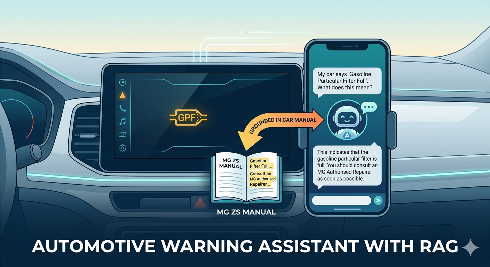
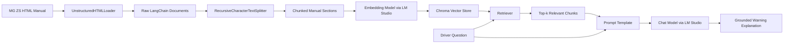

# Automotive Warning Assistant with RAG

This project is a compact Retrieval-Augmented Generation (RAG) demo that answers car warning-message questions using an MG ZS manual as the knowledge source. It shows how to ingest raw documentation, split it into chunks, index it in a vector database, retrieve relevant context, and generate grounded answers with a local LLM served through LM Studio.

The main implementation lives in [notebook.ipynb](c:\Users\siarh\Documents\Yandex\rag_for_tech_doc\notebook.ipynb). The manual source is [mg-zs-warning-messages.html](c:\Users\siarh\Documents\Yandex\rag_for_tech_doc\mg-zs-warning-messages.html), and the project cover illustration is stored in the repository root for easy previewing on GitHub.

## Project Goal

The idea is to simulate a context-aware assistant for drivers. Instead of letting the language model answer from memory, the system first retrieves the most relevant excerpts from the vehicle manual and uses them as context for the response. This makes the answer more reliable, more traceable, and more appropriate for domain-specific questions.

## Architecture

The notebook follows this pipeline:

1. Load the HTML car manual with `UnstructuredHTMLLoader`.
2. Split the document into overlapping chunks with `RecursiveCharacterTextSplitter`.
3. Convert chunks into embeddings with an embedding model exposed by LM Studio.
4. Store embeddings in `Chroma`.
5. Retrieve the most relevant chunks for a user question.
6. Pass the retrieved context and question into a chat model to generate a short answer.

This diagram shows the full RAG loop: the car manual is transformed into searchable vector embeddings, and each user question is answered using the most relevant retrieved chunks rather than model memory alone.

## Tech Stack

- Python
- Jupyter Notebook
- LangChain
- Chroma
- LM Studio
- OpenAI-compatible local API

## Files

- [notebook.ipynb](c:\Users\siarh\Documents\Yandex\rag_for_tech_doc\notebook.ipynb): end-to-end RAG walkthrough
- [mg-zs-warning-messages.html](c:\Users\siarh\Documents\Yandex\rag_for_tech_doc\mg-zs-warning-messages.html): source document used for retrieval
- [Gemini_Generated_Image_bi58a7bi58a7bi58.png](c:\Users\siarh\Documents\Yandex\rag_for_tech_doc\Gemini_Generated_Image_bi58a7bi58a7bi58.png): portfolio illustration used in the README and notebook

## How To Run

1. Install the Python dependencies used in the notebook.
2. Start LM Studio locally.
3. Load one chat model and one embedding model in LM Studio.
4. Make sure the LM Studio local server is exposed at `http://127.0.0.1:1234/v1`.
5. Open [notebook.ipynb](c:\Users\siarh\Documents\Yandex\rag_for_tech_doc\notebook.ipynb) and run the cells top to bottom.

The notebook is currently configured for:

- Chat model: `qwen/qwen3.5-35b-a3b`
- Embedding model: `text-embedding-mxbai-embed-large-v1`

If you use different models in LM Studio, update the model names in the notebook before running it.

## Why This Works Well As a Portfolio Project

- It demonstrates practical LLM application development, not just prompt writing.
- It shows understanding of retrieval, chunking, embeddings, and grounded generation.
- It uses local model serving, which is a nice touch for privacy-conscious or edge-style applications.
- It is easy to explain in an interview because the pipeline is small, clear, and end to end.

## Possible Improvements

- Persist the vector store to disk.
- Add answer citations with retrieved source chunks.
- Evaluate retrieval quality across multiple warning-message queries.
- Turn the notebook into a small Streamlit or FastAPI app.
- Add support for multiple manuals or vehicle models.
