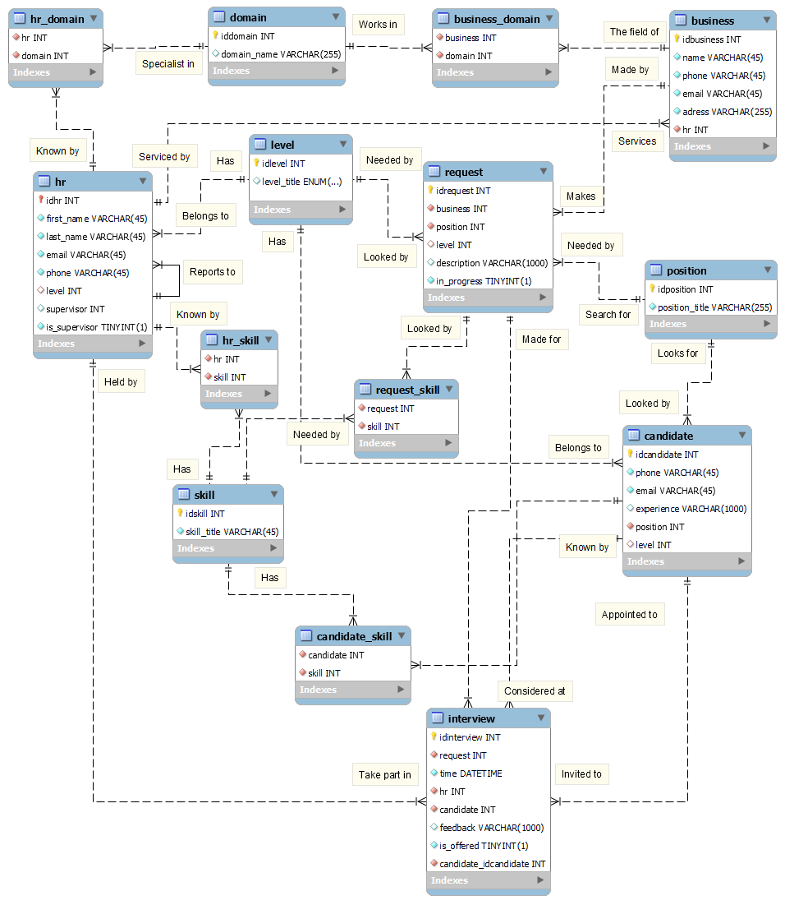

# Recruitment Agency Data Model

  

The Recruitment Agency Data Model is a comprehensive entity-relationship diagram that serves as the backbone for database creation, aimed at enhancing the recruitment operations of a staffing agency. This model meticulously outlines the interconnections among various entities such as businesses, HR professionals, candidates, interviews, and job positions. It is designed to maintain a seamless flow of data, from capturing candidate applications to managing HR activities and business requests.

## Key Components

1. **Business and HR Representation**
   - Outlines the structure for storing critical business client information and their corresponding HR contacts within the agency, ensuring a personal touch in the recruitment process.

2. **Candidate Management**
   - Facilitates the storage of detailed candidate profiles, including contact information, experience, skills, and applied positions, fostering a tailored job-matching procedure.

3. **Interview Coordination**
   - Incorporates scheduling logistics and feedback mechanisms for interviews, guaranteeing timely and concise communication of outcomes.

4. **HR Reporting**
   - Enables HR professionals to report to their supervisors, promoting accountability and the monitoring of recruitment efficiency.

5. **Position and Skill Tracking**
   - Maintains unique listings of job positions and skills, allowing for precise matching between candidates’ qualifications and business needs.

6. **Business Domain Flexibility**
   - Accommodates businesses operating across multiple domains, providing a versatile approach to recruitment across various industry sectors.

The data model's structured approach not only streamlines the recruitment workflow but also ensures that every stakeholder in the hiring process is equipped with the necessary information, leading to informed decision-making and enhanced recruitment quality.