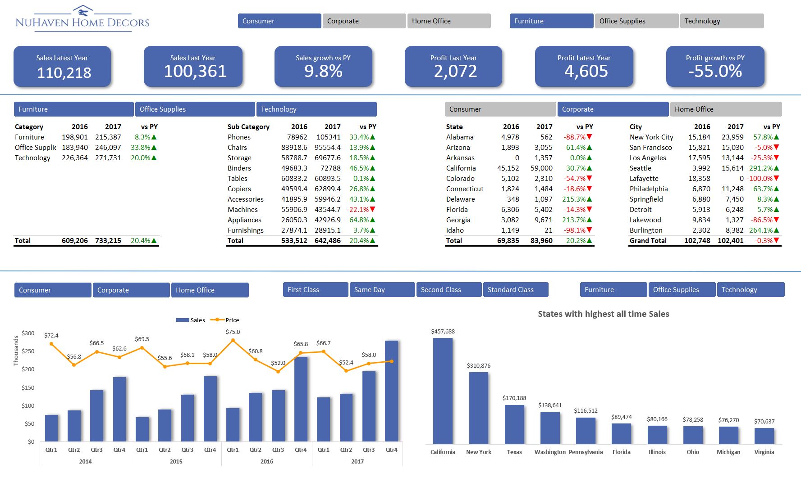

# Excel Sales Analytics Dashboard

  

An intuitive Excel dashboard that offers a dynamic interface to transform raw data into visually appealing and actionable insights.

The dataset showcases sales trends reflecting the year-on-year sales growth or decline. 

Key features of this dashboard include:
- Pivot Tables to aggregate and dissect complex datasets
- Slicers: Integrated to empower users to filter data based on individual preferences
- Unified color theme applied throughout the dashboard, ensuring visual consistency

